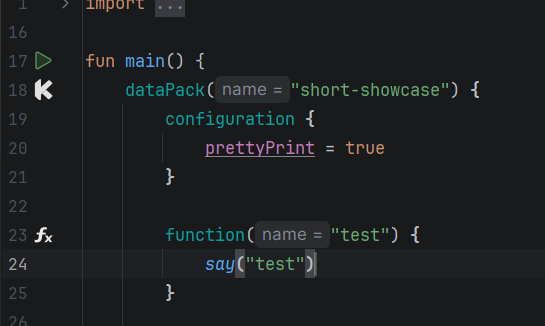
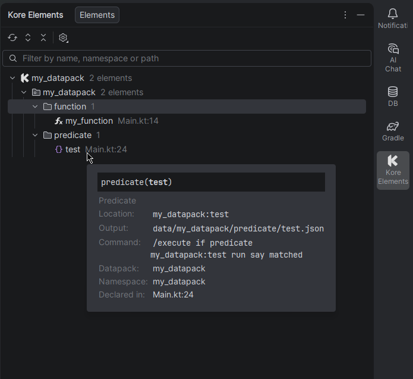

# Kore Assistant

An IntelliJ IDEA extension providing powerful tools for working with [Kore](https://kore.ayfri.com), a Kotlin library
for creating Minecraft datapacks without writing JSON.

<!-- Plugin description -->

An IntelliJ IDEA extension providing powerful tools for working with [Kore](https://kore.ayfri.com), a Kotlin library
for creating Minecraft datapacks without writing JSON. Features:

- Gutter icons for quick identification of Kore `DataPack` objects and functions.
- A "Kore Elements" tool window listing every kind of Kore declaration as a tree mirroring your generated datapack, with
  hover previews, copy actions and jump-to-source.
- Live templates to quickly scaffold `dataPack` and `function` blocks.

<!-- Plugin description end -->

---

**Kore Assistant** enhances your development experience with Kore by providing useful features directly within IntelliJ
IDEA.

## Features

* **Gutter Icons:** Easily identify Kore `DataPack` objects and functions with dedicated icons in the editor gutter.
* **Kore Elements Tool Window:** Browse every kind of Kore declaration (advancements, loot tables, recipes, predicates,
  dialogs, worldgen, and more) as a tree mirroring the generated datapack layout, groupable by output structure, source
  file or flat list, and sortable by name, kind, namespace or declaration order. Filter and speed search narrow the tree
  down; hovering a row shows a documentation-style card with its resource location, generated path, command and source;
  right-clicking offers Copy, Jump to Source and Find Usages.
* **Live Templates:** Quickly create Kore `dataPack` and `function` blocks using the `dp` and `fn` live templates
  respectively.

## Installation

- **Using IDE built-in plugin system:**

  <kbd>Settings/Preferences</kbd> > <kbd>Plugins</kbd> > <kbd>Marketplace</kbd> > <kbd>Search for "Kore
  Assistant"</kbd> > <kbd>Install</kbd>

- **Manually:**

  Download the [latest version](https://plugins.jetbrains.com/plugin/27025-kore-assistant/versions) from JetBrains
  Marketplace and install it manually using <kbd>Settings/Preferences</kbd> > <kbd>Plugins</kbd> > <kbd>⚙️</kbd> > <kbd>
  Install plugin from disk...</kbd>

## Usage

- **Gutter Icons:** Look for the Kore icon next to your `DataPack` object declarations and function definitions.

  

- **Kore Elements Tool Window:** Access the tool window via <kbd>View</kbd> > <kbd>Tool Windows</kbd> > <kbd>Kore
  Elements</kbd>. It lists every Kore declaration found in your current project; double-click an entry to jump to it,
  hover a row for details, or right-click for Copy, Jump to Source and Find Usages.

  

## License

This project is licensed under the MIT License - see the [LICENSE](LICENSE) file for details.

## Acknowledgements

* Based on the [IntelliJ Platform Plugin Template](https://github.com/JetBrains/intellij-platform-plugin-template).
